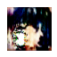

# Anime GAN
Simple implementation of Anime GAN and Anime GAN-GP of [Pyimagesearch](https://pyimagesearch.com/2022/02/07/anime-faces-with-wgan-and-wgan-gp/).

This implementation simply aims to generate anime faces using WGAN and WGAN-GP, just for fun :).

The train_wgan.py script can be used to train the model from scratch. The test_wgan.sh/py is used to generate a sample from the previously trained model. Some examples are shown below.

The models were trained with 50 epochs each with learning rate of 0.00005. The trained models are made available to download. Feel free to fine tune them to achieve even better visual results.

## WGAN generated examples

## WGAN-GP generated examples

